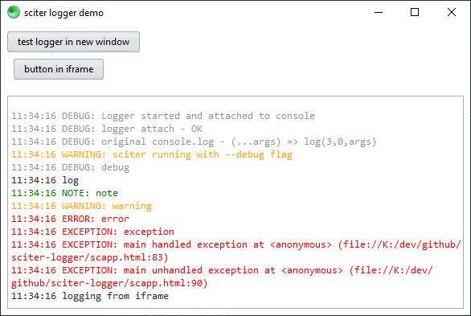

# sciter logger

This is a [sciter.js](https://sciter.com/) logger that listens to the console output and redirects it to a file and/or any html element.

This work was made possible thanks to [https://2ality.com/2015/10/intercepting-method-calls.html](https://2ality.com/2015/10/intercepting-method-calls.html).



## demo

- git clone the repository
- run `install.bat` to download the latest sciter binaries and the sciter package manager
- install packages `php spm.phar install`
- run `scapp.bat`
- to refresh the app after changes to the html/css click `F5`

## install

- add the `src` dir to your project or use the sciter package manager
- in `<script type="module">`

```js
import {logger} from "src/logger.js";

// initialize logger
logger.init({
    file: URL.toPath(__DIR__ + "test.log"),
    clear: true,
});

// attach logger to console
logger.attach();

// capture unhandled exceptions
logger.capture();

// log
console.log("new logger test");
```

### enhanced console

Console is enhanced with new methods

```js
console.debug("test debug");
console.exception("test exception");
console.note("test note");
console.line();
```

Objects are converted to string

````js
console.debug({
    a: 1,
    b: {
        alpha: "test",
        beta: "yet another test"
    },
    c: 3,
});
```

### redirect console output

Console output can be redirected to a plaintext element

```js
logger.plaintext(document.$("plaintext"));
```

Output can be colored if you include the stylesheet

```html
<style src="src/logger.css" />
```

### subscribe to logger

````js
logger.subscribe(function(level, message) {

});
```

### multiple windows and iframes

- as each `Window` has its own console, you will need to use the `console` object from the parent window:

```js
import {logger} from "src/logger.js";

// get console from parent
logger.setConsole();
```

- unhandled exceptions must also be captured in every new `Window`.

```js
import {logger} from "src/logger.js";

// capture unhandled exceptions
logger.capture();
```

`iframe`s behave just like `Window`s in that aspect.

## known issues

- no known issues

## ideas

- open log file only once? would require non-exclusive rights to the file
- spawn a separate logging window
- add icons for each channel
